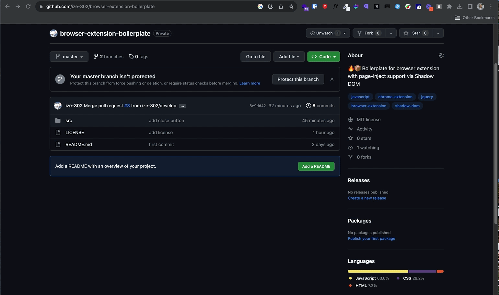

## Browser Extension Boilerplate 🔥📦

Boilerplate for browser extension with page-inject support via the shadow DOM

#### How to use

- Clone this repository
- Unpack the extension in your chrome browser:
  - Go to "More tools" > "Extensions."
  - Enable "Developer mode" by toggling the switch on the top right corner of the page.
  - Click on "Load unpacked" button, select the folder containing your unpacked extension, which is located in the `src` folder and click on "Select Folder."
- Its all yours 💪

#### PS:

For every change you make, you have to reload the extension for the changes to take effect 💀

#### supported browsers

- Chrome
